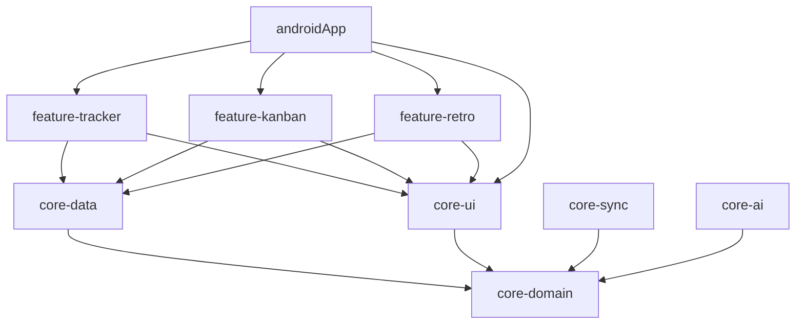

# Sprint: Phase 0 Architecture and Scaffolding

## 1. Objective and Overview
The initial phase of the **Sprint** project focused on migrating a monolithic Android template into a modern, scalable, and Kotlin Multiplatform (KMP) ready architecture. The objective was to lay down a solid foundation that supports the "Pure Domain" philosophy and cleanly separates UI features, data persistence, sync logic, and AI classification.

## 2. Module Architecture

The project has been refactored into the following modules to ensure strict separation of concerns (Clean Architecture) and faster parallel compilation times:

- **`:androidApp`**: The main entry point. It acts as the "shell" that wires dependencies together via Hilt, handles the Application class, navigation, and core Android services (like `UsageStatsManager` and widgets).
- **`:core-domain`**: The pure Kotlin heart of the application. It contains data classes (`Context`, `Task`, `Session`, `Project`), Repository interfaces, and domain rules. It has zero Android framework dependencies.
- **`:core-data`**: Contains the local Room database, entities, and DAO implementations of the repository interfaces defined in `:core-domain`.
- **`:core-sync`**: Handles background synchronization (Ktor client). Depends strictly on `:core-domain` to prevent tight coupling with Room.
- **`:core-ai`**: Contains the LLM integration logic (Groq / Gemini) and prompt configurations.
- **`:core-ui`**: A centralized design system module holding the `SprintTheme`, typography, colors, and shared Compose UI components. This solves the circular dependency problem of feature modules needing styling but not being able to depend on the app module.
- **`:feature-tracker`**: Compose UI for live session tracking.
- **`:feature-kanban`**: Compose UI for the task board.
- **`:feature-retro`**: Compose UI for the weekly retrospective overview.

### Dependency Graph (Simplified)

## 3. Dependency Management and Tooling

### Version Catalog (`libs.versions.toml`)
All dependencies are centralized in `gradle/libs.versions.toml`. 
Key technology choices include:
- **Kotlin**: 2.1.0
- **AGP**: 8.9.1 (with Gradle 8.11.1 wrapper)
- **Hilt**: 2.56 (using KSP 2.1.0-1.0.29, maintaining compatibility with Kotlin 2.1.0)
- **Compose**: BOM 2026.06.01
- **Room**: 2.7.1
- **Ktor**: 3.0.1

*Engineering Decision Note:* We explicitly downgraded `kotlinx-datetime` to `0.6.1` and `Kotlin` to `2.1.0` due to Hilt 2.56's metadata incompatibility with Kotlin 2.3+.

### CI/CD and Static Analysis
- **GitHub Actions**: A `ci.yml` pipeline is set up to run `./gradlew assembleDebug`, `test`, `detekt`, and `lint` on every push/PR to `main` and `develop`.
- **Detekt**: Configured with a `detekt.yml` file specifically tuned for a Compose Android project (e.g., relaxing the `MagicNumber` rule for modifier padding offsets).

## 4. Key Architectural Mechanisms

### Dependency Inversion (Repositories)
The Repository pattern is used with strict Dependency Inversion. For example, `TaskRepository` is defined as an interface in `:core-domain`, but its Room-backed implementation lives in `:core-data`. When `:core-sync` needs to sync tasks, it injects the `:core-domain` interface, meaning `:core-sync` remains completely ignorant of Room or SQLite.

### Local Feature Flagging
A `FeatureFlags.kt` object was created in `:core-domain` to gate incomplete code paths during development. This allows the MVP to ship safely while complex backend sync or physical tracking logic remains disabled at compile-time.

## 5. Next Steps
With the scaffolding, KSP/Hilt integration, and design system extracted, the project is ready for **Phase 1: Local Data Persistence** (implementing the Room entities, DAOs, and repository concrete classes in `:core-data`).
