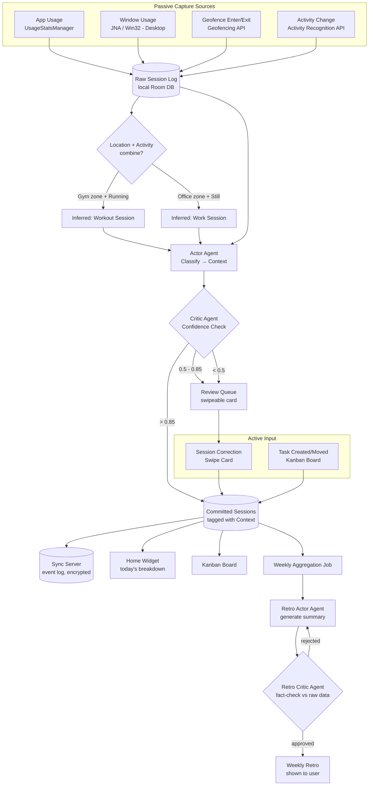

# Sprint — Full Tracking Surface (current scope)

Everything below is buildable with what we've already scoped — no Health Connect, no shopping/transaction parsing.

---

## 1. All Trackable Signals

| Source | Signal | Captured Data | Capture Method | Auto-commit? |
|---|---|---|---|---|
| **App Usage** | Foreground app switch | package name, start/end time | `UsageStatsManager` polling | Yes, if classifier confidence > 0.85 |
| **App Usage** | Idle / screen-off | session auto-close | screen-off broadcast receiver | Yes |
| **Window (Desktop, Phase 10+)** | Foreground window switch | window title, app name, start/end time | JNA → `GetForegroundWindow` | Yes, if confidence > 0.85 |
| **Location** | Enter/exit fixed zone | zone name (Office/Home/Gym/etc), timestamp | Geofencing API (enter/exit callback only, no continuous GPS) | No — always queued for confirmation |
| **Activity** | Motion state change | `WALKING`, `RUNNING`, `IN_VEHICLE`, `STILL`, `ON_BICYCLE` | Activity Recognition API | No — combined with geofence, then queued |
| **Manual Task** | Task created/moved | title, context, status, estimate | User input on Kanban board | Always manual (by design — this is intentional input, not passive capture) |
| **Manual Correction** | Retag a session | old context → new context | Swipe on review card | Always manual |
| **System** | Weekly aggregate | rollup of all above per context | Scheduled job (WorkManager) | Auto-generated, but critic-gated before shown |

**Deliberately out of scope right now:** Health Connect (workout detail), transaction/shopping parsing.

---

## 2. Data Model — Unified Session Source

```kotlin
enum class SessionSource { APP_USAGE, WINDOW_USAGE, LOCATION, ACTIVITY, MANUAL }

data class Session(
    val id: String,
    val deviceId: String,
    val source: SessionSource,
    val rawLabel: String,        // package name / window title / geofence name / activity type
    val startTime: Instant,
    val endTime: Instant?,
    val contextId: String?,      // null until classified
    val confidence: Float?,
    val isManuallyCorrected: Boolean
)
```

One table, one pipeline, regardless of which sensor produced the raw signal — this is why adding location/activity later doesn't require new architecture, just a new `SessionSource` value and a new capture service feeding the same queue.

---

## 3. End-to-End Data Flow



---

## 4. Single-Event Sequence — Example: Gym Session

```mermaid
sequenceDiagram
    participant OS as Android OS
    participant Geo as Geofence Service
    participant Act as Activity Recognition
    participant DB as Local Session DB
    participant Actor as Classifier Actor
    participant Critic as Classifier Critic
    participant You as You (Review Card)

    OS->>Geo: Enter "Gym" zone
    Geo->>DB: Write raw Session(source=LOCATION, rawLabel="Gym", start=T1)
    OS->>Act: Detect RUNNING
    Act->>DB: Write raw Session(source=ACTIVITY, rawLabel="RUNNING", start=T1)
    DB->>Actor: Combine overlapping Location+Activity sessions
    Actor->>Actor: Infer context = "Life / Workout"
    Actor->>Critic: confidence = 0.78
    Critic->>DB: Below auto-commit threshold → queue
    DB->>You: Show card "20 min at Gym, running — log as Workout?"
    You->>DB: Confirm
    DB->>DB: Commit as Session(context="Life", isManuallyCorrected=false)
```

---

## 5. Why this scales cleanly

- **One raw table, one pipeline** — location and activity signals slot into the exact same `Session` → classify → critic → commit flow as app usage. No parallel system.
- **Passive sources never auto-commit physical data** — only digital (app/window) signals earn auto-commit trust, since a wrong geofence trigger is more disruptive than a mistagged browser tab. This is a deliberate asymmetry, not an oversight.
- **The retro agent doesn't care where data came from** — it aggregates by `contextId`, so a workout session and a coding session are equally valid inputs once committed.

