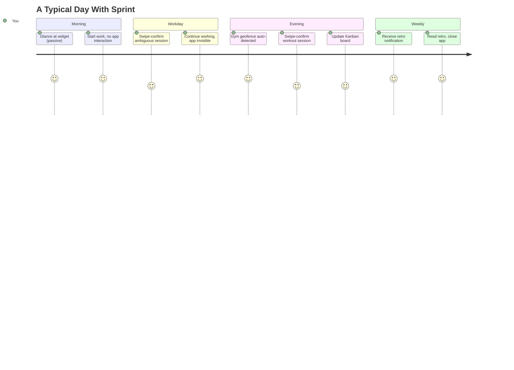

# Sprint — User Journey (A to Z)

A full walkthrough of what you actually experience day-to-day, paired with what's happening behind the scenes at each step.

---

## 1. Day-in-the-Life Narrative

**7:45 AM — Wake up, glance at phone**
You don't open the app. The home-screen widget already shows yesterday's breakdown: *"Internship 5h40m · CSE3443 1h20m · Life 2h10m."* No action needed — this is passive, ambient information, like a weather widget.

**9:00 AM — Start work at Exact**
You open VS Code on your laptop. Nothing to log manually. The desktop window daemon has already picked up the switch.

**9:00 AM – 6:00 PM — Normal workday**
You move between VS Code, Slack, browser, Obsidian for notes. Each switch is silently recorded. Once, mid-afternoon, you get a swipe-confirm notification: *"32 min on Chrome — Internship or CSE3443?"* — one tap, done. This happens maybe 2-3 times a day, not constantly.

**6:30 PM — Head to the gym**
Your phone detects you've entered the Gym geofence and picked up running activity. Nothing happens yet — it's just quietly logging in the background.

**7:15 PM — Leave the gym**
A card appears: *"45 min at Gym, running detected — log as Workout?"* Swipe to confirm. Takes two seconds.

**8:00 PM — Open the Kanban board**
This is the one part of the app you actually open intentionally. You move a task from "In Progress" to "Review," add a new task for tomorrow. Takes 30 seconds.

**Sunday, 9:00 PM — Weekly retro notification**
A single notification: *"Your week is ready."* You open it. One headline insight — e.g. *"CSE3443 got 40% less time than last week, mostly displaced by a Wednesday Internship crunch"* — plus a simple bar breakdown. You read it in under a minute, maybe adjust next week's priorities mentally, close the app.

**That's the entire loop.** Most days: zero deliberate app opens beyond a glance at the widget and 1-2 ten-second swipe confirmations. One evening a week: a 60-second Kanban check-in. One Sunday moment: the retro.

---

## 2. Mermaid User Journey Map

---

## 3. Full Process Map — User Action vs. Behind-the-Scenes

| # | What You Do | What You See | What Happens Behind the Scenes |
|---|---|---|---|
| 1 | Nothing — just use your phone/laptop normally | Nothing | `UsageStatsManager` / window daemon logs raw `Session(source=APP_USAGE/WINDOW_USAGE)` to local Room DB |
| 2 | Nothing | Nothing | Debounce + merge pass cleans noisy switches; rule-based pre-filter classifies known apps instantly |
| 3 | Nothing (for high-confidence sessions) | Widget updates silently | Unresolved sessions go to Actor Agent → Critic Agent; confidence > 0.85 auto-commits |
| 4 | Swipe a review card | *"32 min Chrome — which context?"* | Session was 0.5–0.85 confidence; your answer commits it **and** updates the rule table / few-shot cache for next time |
| 5 | Walk into the gym | Nothing yet | Geofence + Activity Recognition fire, write raw `Session(source=LOCATION/ACTIVITY)`, always queued (never auto-commits) |
| 6 | Swipe the workout card | *"45 min Gym, running — log as Workout?"* | Location + Activity sessions combined, confirmed session committed with `contextId = Life` |
| 7 | Move a Kanban card | Task status changes on screen | Direct write to local `Task` table, `updatedAt` + `deviceId` stamped for future sync conflict resolution |
| 8 | Open laptop later, keep working | Widget on phone updates within sync interval | Desktop writes local event → pushes to sync server → phone pulls on next check-in → merges into local DB |
| 9 | Nothing (Sunday evening) | Notification: *"Your week is ready"* | WorkManager job aggregates the week's committed sessions per context |
| 10 | Nothing | — | Retro Actor Agent drafts summary → Retro Critic Agent fact-checks against raw aggregates → only approved text is shown |
| 11 | Open and read the retro | One headline insight + bar chart | Static render of the approved retro text — no further AI calls |
| 12 | (Rarely) Manually retag a past session | Session's context updates | Correction feeds back into rule table/few-shot cache; also logged for the Phase 13 accuracy eval set |

---

## 4. What Makes This Loop Sustainable

- **The only two things you ever *do* deliberately:** occasional swipe-confirms (seconds each) and a weekly Kanban/retro check-in. Everything else is passive.
- **The app is designed to be looked at, not opened** — widget for daily glance, notification for weekly retro. Cold-opening the app itself is the exception, not the routine.
- **Every confirmation you give makes the next one less likely to be needed** — the feedback loop (Phase 3d) means the swipe-confirm frequency should trend down over your first few weeks of use, not stay constant.
- **The system never asks you to explain yourself** — no free-text journaling, no forms. Every interaction is a tap on something the system already inferred.

